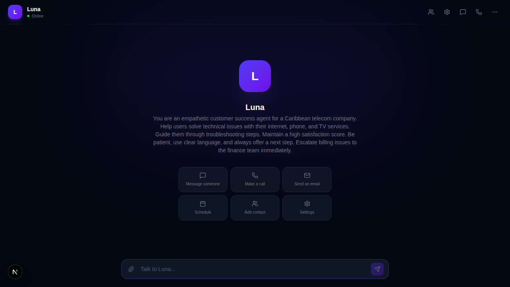
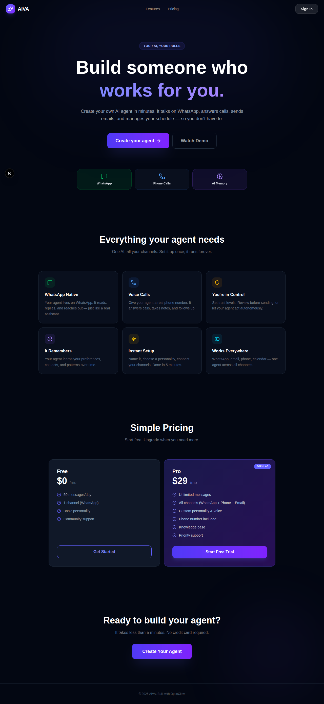
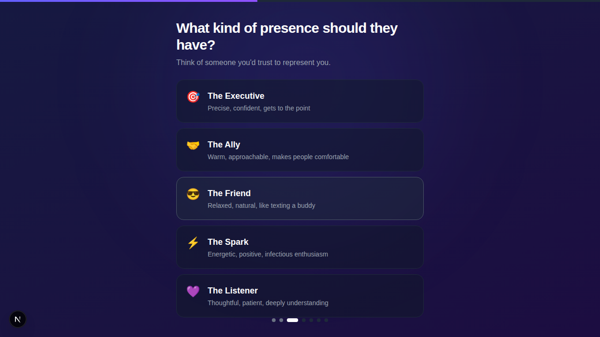
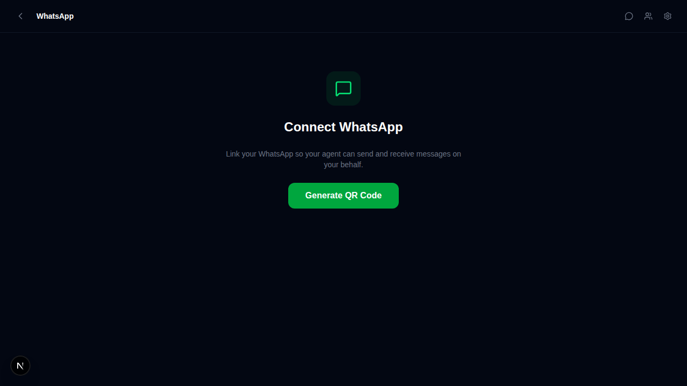
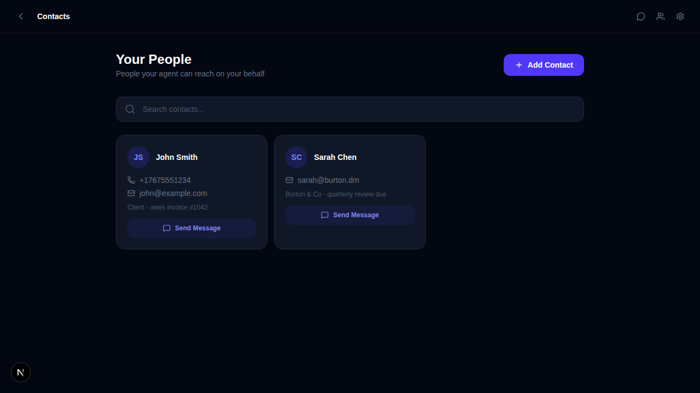
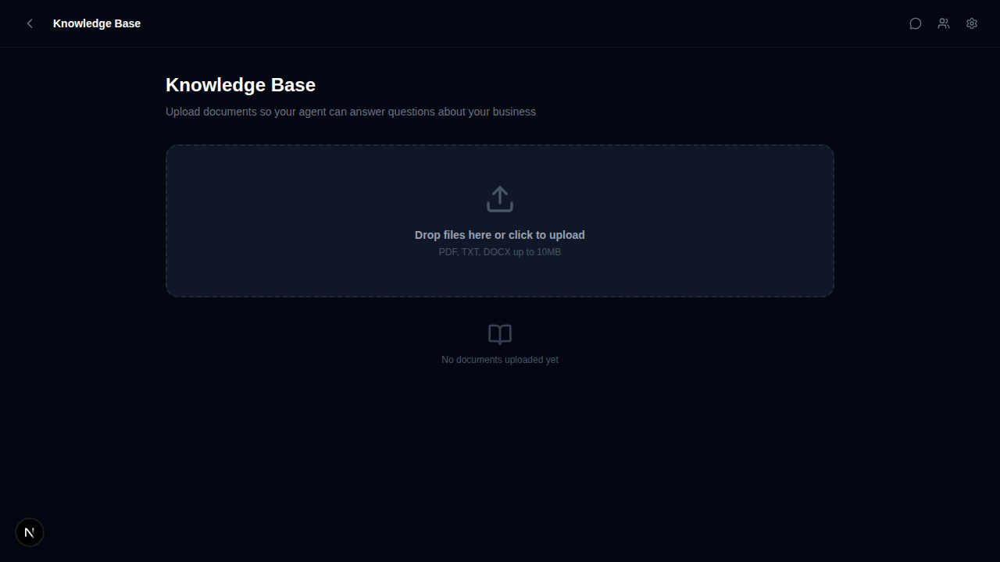
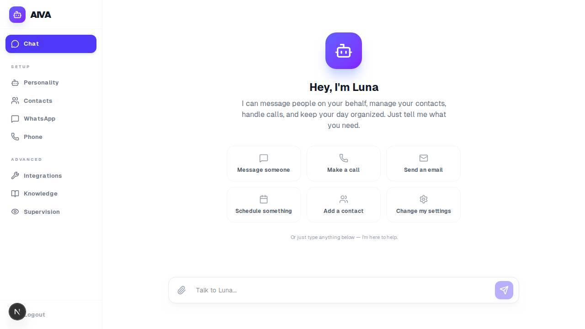
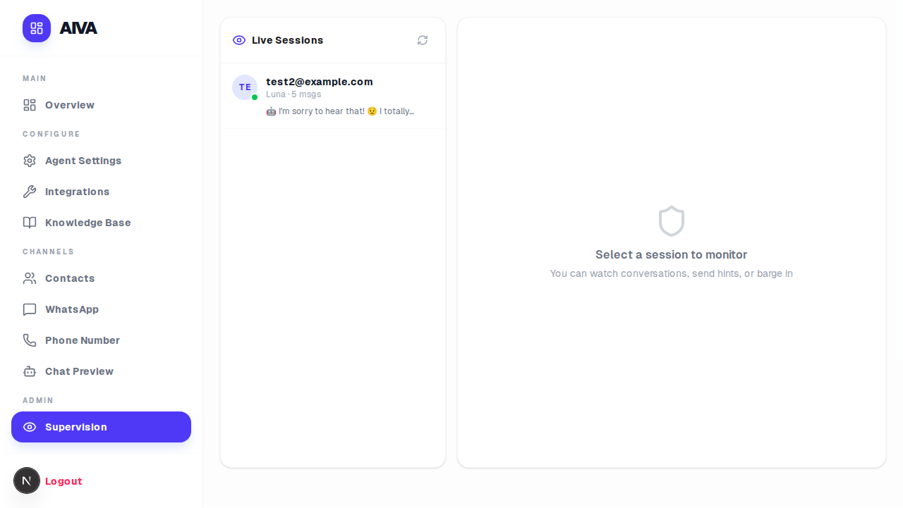

# AIVA — AI Personal Assistant

> Build someone who works for you.

AIVA lets users create their own AI personal assistant with a name, personality, and purpose — then deploy it to WhatsApp, voice calls, and more.



## Features

- 🤖 **Agent Creation Wizard** — Name, personality, purpose, abilities, trust level
- 📱 **WhatsApp Integration** — Connect your WhatsApp via QR code, agent handles conversations
- 📞 **Voice Calls** — LiveKit-powered voice with SIP trunk support
- 💬 **Chat Interface** — Talk to your agent directly in the browser
- 👥 **Contact Management** — Import contacts, smart add, agent knows your people
- 🧠 **Knowledge Base** — Teach your agent custom information
- 👁️ **Admin Supervision** — Monitor live conversations, send hints, delegate chats
- 🔐 **Auth** — Email/password signup with JWT sessions
- 🌙 **Dark Mode** — Full dark theme UI
- ⚡ **OpenClaw Integration** — Deploys agents via OpenClaw gateway

## Screenshots

| Landing | Create Agent | Dashboard | WhatsApp |
|---------|-------------|-----------|----------|
|  |  |  |  |

| Contacts | Knowledge | Chat | Admin |
|----------|-----------|------|-------|
|  |  |  |  |

## Tech Stack

- **Framework:** Next.js 16 (App Router, React 19)
- **Database:** SQLite via Prisma ORM
- **WhatsApp:** Baileys (WhiskeySockets)
- **Voice:** LiveKit + SIP
- **Auth:** bcryptjs + JWT cookies
- **UI:** Tailwind CSS + Lucide icons + Framer Motion
- **AI Backend:** OpenClaw gateway (supports any LLM)

## Quick Start

### Prerequisites

- Node.js 20+
- npm or pnpm

### 1. Clone & Install

```bash
git clone https://github.com/epicdm/Aipersonalassistantmvp.git
cd Aipersonalassistantmvp
npm install
```

### 2. Environment Setup

Copy the env template and fill in your values:

```bash
cp .env.example .env
```

### 3. Database Setup

```bash
npx prisma generate
npx prisma db push
```

### 4. Run

```bash
# Development
npm run dev

# Production
npm run build
npm start
```

Open [http://localhost:3000](http://localhost:3000)

## Environment Variables

| Variable | Required | Description |
|----------|----------|-------------|
| `DATABASE_URL` | ✅ | SQLite connection string (e.g. `file:./dev.db`) |
| `JWT_SECRET` | ✅ | Secret key for JWT token signing (any random string, 32+ chars) |
| `OPENCLAW_GATEWAY_TOKEN` | ⬡ | OpenClaw gateway auth token (for AI agent deployment) |
| `LIVEKIT_URL` | ⬡ | LiveKit server URL (for voice calls) |
| `LIVEKIT_API_KEY` | ⬡ | LiveKit API key |
| `LIVEKIT_API_SECRET` | ⬡ | LiveKit API secret |
| `LIVEKIT_AGENT_NAME` | ⬡ | Name of the LiveKit agent |
| `MAGNUSBILLING_URL` | ⬡ | MagnusBilling API URL (for phone number provisioning) |
| `MAGNUSBILLING_API_KEY` | ⬡ | MagnusBilling API key |
| `MAGNUSBILLING_API_SECRET` | ⬡ | MagnusBilling API secret |
| `MAGNUS_SIP_IP` | ⬡ | SIP server IP for voice routing |

✅ = Required to run &nbsp;&nbsp; ⬡ = Optional (feature won't work without it)

## Project Structure

```
app/
├── api/                    # API routes
│   ├── auth/               # Login, signup, logout
│   ├── agent/              # Agent CRUD, deploy, soul generation
│   ├── chat/               # Chat with agent
│   ├── contacts/           # Contact management
│   ├── conversations/      # Conversation history
│   ├── number/             # Phone number provisioning
│   └── whatsapp/           # WhatsApp QR pairing
├── components/             # Shared UI components
│   ├── landing.tsx         # Marketing/landing page
│   ├── overview.tsx        # Dashboard overview
│   ├── sidebar-layout.tsx  # App shell with sidebar nav
│   ├── whatsapp-manager.tsx
│   └── ...
├── lib/                    # Core libraries
│   ├── db.ts               # Prisma client
│   ├── localdb.ts          # LowDB for agent config
│   ├── session.ts          # JWT session management
│   ├── soul-generator.ts   # Generates SOUL.md from UI config
│   ├── chat-store.ts       # In-memory chat state
│   └── runtime/            # Agent runtime
│       ├── agent-launcher.ts
│       └── free-tier.ts
├── create/                 # Agent creation wizard
├── dashboard/              # Main dashboard
├── chat/                   # Chat interface
├── contacts/               # Contact management
├── knowledge/              # Knowledge base
├── settings/               # Agent settings
├── admin/                  # Supervision dashboard
├── whatsapp/               # WhatsApp connection
└── number/                 # Phone number setup
prisma/
├── schema.prisma           # Database schema
└── migrations/             # Migration files
```

## How It Works

1. **User signs up** → creates account with email/password
2. **Creates an agent** → wizard walks through name, personality, purpose, abilities
3. **SOUL.md generated** → `soul-generator.ts` converts UI config into an OpenClaw personality file
4. **Agent deployed** → pushed to OpenClaw gateway as a running agent instance
5. **Connects channels** → WhatsApp (QR scan), voice (LiveKit SIP), browser chat
6. **Agent operates** → handles conversations, manages contacts, follows trust/approval rules

## License

Proprietary — EPIC Communications Inc.

## Credits

Built by [EPIC Communications](https://epic.dm) 🇩🇲
